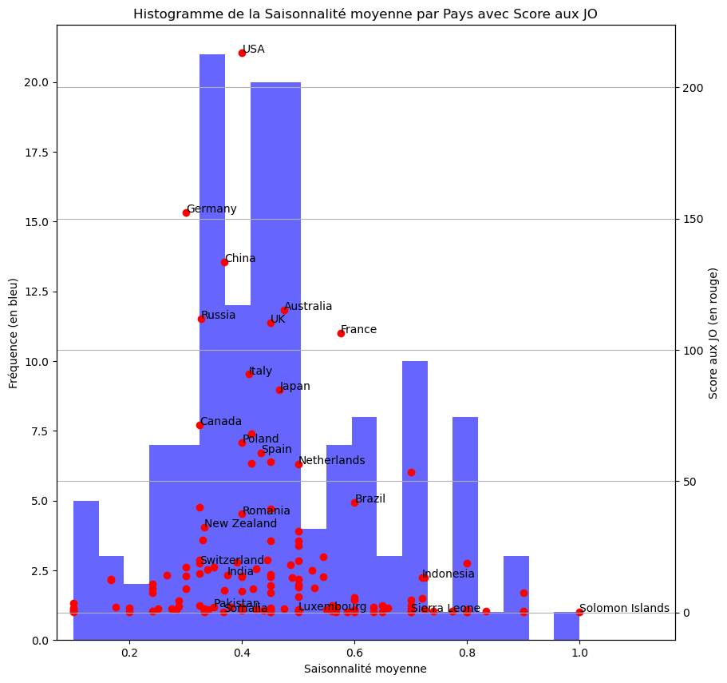
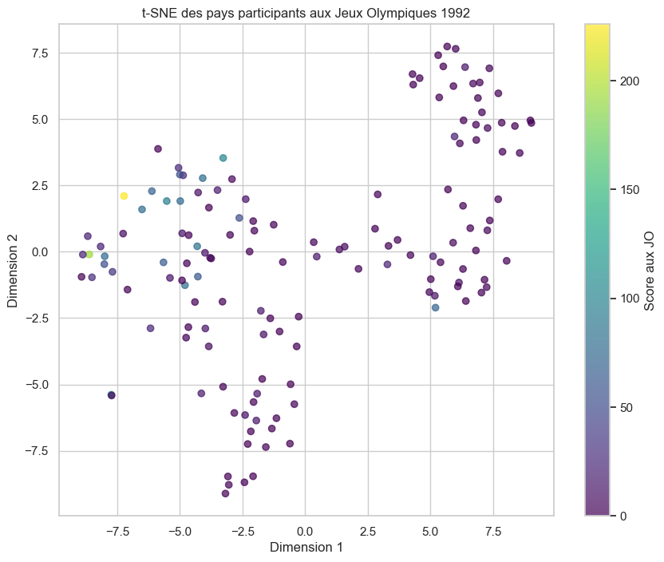
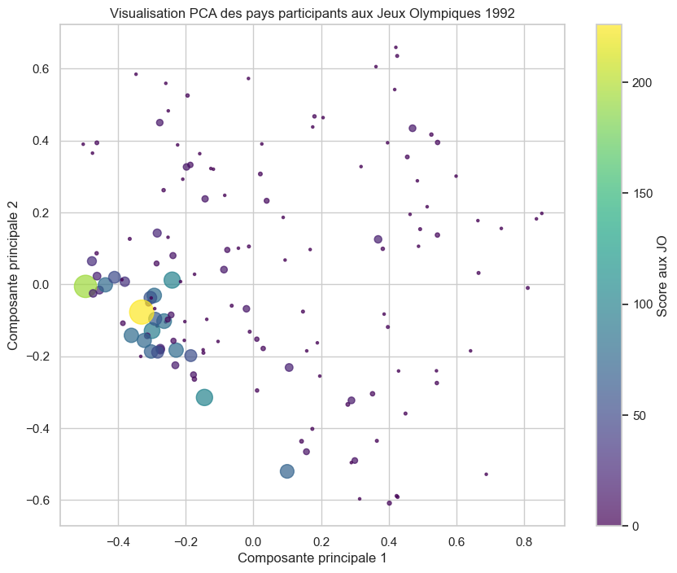
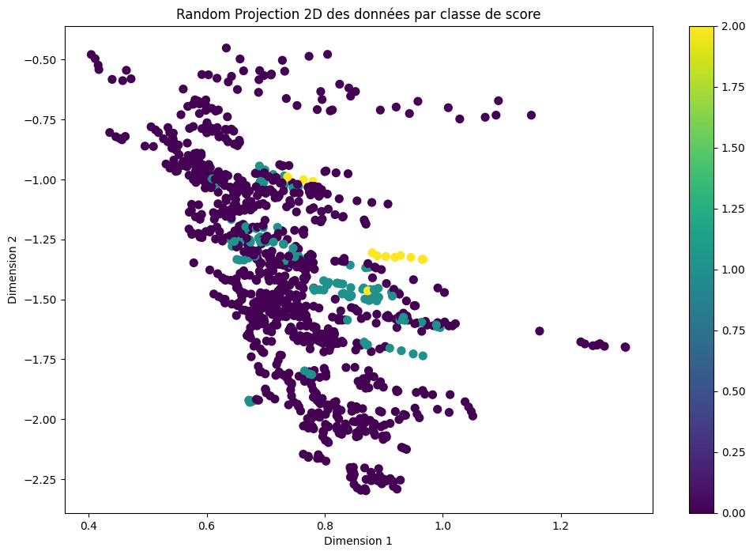

# Rapport Final : Projet Predictus Olympiae

### Julien Mühlemann (JM), Cristhian Ronquillo (CR), Dr. Ing. Julien Billeter (JB)

# Table des Matières

1. **Introduction**

2. **Présentation du Projet**
      - 2.1 Contexte<br>
      - 2.2 Problématique<br>
      - 2.3 Objectifs<br>

3. **Sources de Données**
      - 3.1 
      - 3.2 Disciplines Sélectionnées
      - 3.3 Données Socio-économiques et Démographiques  
      - 3.4 Données Climatiques  

4. **Méthodologie**
      - 4.1 Planification et Organisation**
      - 4.2 Approches Supervisée et Non Supervisée  

 5. **Implémentation**
      - 5.1 Préparation des Données  
      - 5.2 Analyse Exploratoire des Données  
         - 5.2.1 Corrélations entre Variables  
         - 5.2.2 Analyse en Composantes Principales  
         - 5.2.3 Sélection d'Attributs  
      - 5.3 Méthodes Non Supervisées  
         - 5.3.1 UMAP  
         - 5.3.2 t-SNE  
         - 5.3.3 PCA  
         - 5.3.4 Random Projection  
         - 5.3.5 MDS  
         - 5.3.6 Isomap  
         - 5.3.7 Cartes auto-organisatrices (SOM)  
      - 5.4 Méthodes Supervisées  
         - 5.4.1 Arbre de Décision, Forêt Aléatoire, et XGBoost  
         - 5.4.2 Réseaux de Neurones  

6. **Conclusion**

7. **Références**


## 1. Introduction

## 1. Introduction  

Les Jeux Olympiques, véritable célébration des performances sportives mondiales, transcendent le cadre d’un simple événement sportif. Ils symbolisent l’excellence, le dépassement de soi et reflètent souvent les capacités économiques, culturelles et organisationnelles des nations participantes.  

Dans cette optique, le projet **Predictus Olympiae** vise à explorer et modéliser les performances olympiques des pays. Grâce à l’analyse de multiples variables – notamment socio-économiques, démographiques et climatiques – ce projet ambitionne de fournir des outils analytiques capables d’identifier les facteurs déterminants du succès sportif et, potentiellement, de prédire les performances futures.

## 2. Présentation du Projet

### 2.1 Contexte  

Depuis leur résurrection moderne en 1896, les Jeux Olympiques (JO) sont devenus un symbole global de l’unité et de la compétition entre nations. Chaque médaille remportée témoigne non seulement des efforts individuels, mais aussi du soutien institutionnel et des investissements nationaux dans le sport.  

Dans ce contexte, le projet **Predictus Olympiae** ambitionne d'analyser les facteurs permettant d'expliquer les performances olympiques. En s’appuyant sur des données variées, il explore les liens entre des variables telles que le PIB par habitant, la population, le climat, et les résultats sportifs passés.  

### 2.2 Problématique  

Prédire les performances olympiques est un défi complexe pour plusieurs raisons :  
- **Hétérogénéité des données** : Les facteurs influençant les performances sportives proviennent de domaines divers, tels que l’économie, la sociologie et le climat.  
- **Complexité des interactions** : Les relations entre ces variables sont souvent non linéaires et peuvent inclure des effets combinatoires ou contextuels.  
- **Données historiques incomplètes** : Certaines informations essentielles, comme le financement sportif ou des données démographiques précises, sont parfois indisponibles ou hétérogènes.  

Le projet doit ainsi relever ces défis pour développer des modèles à la fois fiables et interprétables.  

### 2.3 Objectifs  

Le projet s’articule autour des objectifs suivants :  

- **Must Have** :  
  - Développer un modèle prédictif performant basé sur l’apprentissage supervisé pour estimer les performances des pays aux Jeux Olympiques.  
  - Fournir des prédictions exploitables couvrant un large éventail de disciplines sportives regroupées.  

- **Nice to Have** :  
  - Réaliser une analyse détaillée par discipline sportive afin d’identifier les forces et faiblesses spécifiques des pays.  
  - Explorer des techniques avancées d’optimisation des modèles, telles que le fine-tuning des hyperparamètres ou l’intégration d’approches basées sur le deep learning.  

## 3. Sources de données  

Le projet **Predictus Olympiae** s'appuie sur la collecte de données issues de diverses sources fiables. Les principales catégories de données utilisées incluent :  

#### 3.1 Données historiques des résultats olympiques  

Les informations sur les performances des nations aux précédents Jeux Olympiques ont été collectées via Kaggle [1]. Les données brutes ont été transformées pour refléter le nombre d'athlètes par nation figurant parmi les 10 premiers dans chaque discipline.  

Étant donné que les Jeux Olympiques d'été incluent un plus grand nombre de disciplines et possèdent un historique plus riche, notre analyse se concentre exclusivement sur ces derniers.

#### 3.2 Disciplines Sélectionnées  

Nous avons choisi de concentrer notre analyse sur les disciplines suivantes :  

**Sports présents aux Jeux Olympiques d'été avant 1988**  
- Tir  
- Plongeon  
- Canoë Sprint  
- Cyclisme sur route  
- Football  
- Boxe  
- Basketball  
- Cyclisme sur piste  
- Escrime  
- Water-polo  
- Lutte  
- Gymnastique artistique  
- Haltérophilie  
- Pentathlon moderne  
- Hockey sur gazon  
- Athlétisme  
- Natation  
- Voile  
- Aviron  

**Sports ajoutés après 1988**  
- Tennis de table  
- Badminton  
- Canoë Slalom  
- Gymnastique rythmique  
- Volley-ball  
- Natation artistique  
- Tennis  
- Équitation  
- Tir à l'arc  
- Handball  
- Judo  

Les autres disciplines n'ont pas été retenues car nous avons estimé que l'historique des performances disponibles était insuffisant pour une analyse pertinente.

#### 3.3 Données socio-économiques et démographiques  

Les données socio-économiques et démographiques proviennent des ensembles de données de Gapminder. Elles incluent des indicateurs clés tels que :  

- **Mortalité infantile** (*child*) : Mesure du taux de mortalité des enfants de moins de cinq ans, un reflet des conditions de santé publique et du développement global d’une nation [2].  
- **Fertilité** (*fertility*) : Nombre moyen d’enfants par femme, un indicateur fondamental des dynamiques démographiques [3].  
- **PIB par habitant** (*capita* ou *gdp*) : Représente la richesse économique d’un pays, un facteur crucial pour évaluer les ressources disponibles pour le développement sportif [4].  
- **Population totale** (*pop*) : Indique la taille du vivier de talents sportifs potentiels dans chaque pays [5].  
 

#### 3.4 Données climatiques

Les données climatiques utilisées dans cette étude proviennent du système de classification *Köppen-Geiger*, qui catégorise les climats mondiaux en fonction de paramètres tels que les températures, les précipitations et la saisonnalité. Chaque type de climat est représenté par un code, comme "Af" pour les climats équatoriaux humides ou "BWk" pour les climats désertiques froids. 

Pour intégrer ces données dans l’analyse, chaque code climatique a été associé à quatre indices numériques représentant la température, les précipitations, la saisonnalité et l’aridité. Ces indices, compris entre 0 et 1, ont été définis via des règles heuristiques et des interprétations subjectives des définitions Köppen-Geiger. Une valeur de 1 pour la température indique un climat chaud, tandis qu’une valeur de 0 correspond à un climat très froid. Pour les précipitations, une valeur de 1 traduit une humidité importante, tandis qu’une valeur de 0 caractérise des régions très sèches. La saisonnalité est élevée (proche de 1) dans les régions où les variations climatiques sont faibles, et l’aridité est maximale (1) dans les zones désertiques.

Pour chaque pays, les types de climats présents ont été traduits en indices numériques selon ces correspondances. Les indices des différents climats au sein de chaque pays ont été moyennés pour obtenir des valeurs nationales représentatives des quatre dimensions climatiques (*Avg_Temperature*, *Avg_Precipitation*, *Avg_Seasonnality*, et *Avg_Aridity*). Ces moyennes ont ensuite été normalisées entre 0 et 1 afin de garantir une comparabilité entre les pays et faciliter l'interprétation des résultats. Cette approche permet de synthétiser de manière cohérente les caractéristiques climatiques des pays tout en tenant compte de la diversité des climats locaux.

## 4. Méthodologie

### 4.1 Planification et Organisation  

Les tâches ont été réparties comme suit : JM, CR et JB ont recherché et trié les données. JM s'est particulièrement concentré sur les données relatives aux performances olympiques et au climat, tandis que JB a principalement traité les données socio-économiques et sociologiques. JM et JB ont harmonisé les noms des pays dans chacun des ensembles de données selon les difficultés décrites dans la Section 5.1. L'analyse exploratoire des données (Section 5.2) a été réalisée par JB.  

Les apprentissages supervisés et non supervisés ont été menés en parallèle selon une approche agile (Scrum), en organisant le travail en sprints et en réajustant régulièrement les objectifs. JM et, dans une moindre mesure, JB ont travaillé sur le développement du réseau de neurones (Section 5.4.2). CR et, dans une moindre mesure, JB ont pris en charge la classification non supervisée (Section 5.3), à l'exception des Cartes auto-organisatrices (Section 5.3.7), développées par JM, ainsi que la construction des arbres de décision, forêts aléatoires et autres méthodes de boosting (Section 5.4.1).  

La rédaction du rapport a été réalisée conjointement par JM, CR et JB. Les outils de communication utilisés incluaient WhatsApp, Discord et Teams, les e-mails traditionnels. Le développement s'est fait individuellement ainsi que par *pair programming* et *real-time collaborative coding*. 

### 4.2 Approches Supervisée et Non Supervisée

L’apprentissage supervisé et l’apprentissage non supervisé diffèrent principalement par la nature des données utilisées et les objectifs visés.  

Dans l’apprentissage supervisé, le modèle est entraîné à partir de données étiquetées, où chaque entrée est associée à une sortie connue. Cette approche est utilisée pour des tâches telles que la **régression** (prédiction de valeurs continues) ou la **classification supervisée** (catégorisation d’observations selon des classes définies).  

En revanche, l’apprentissage non supervisé travaille sur des données non étiquetées, sans information préalable sur les résultats attendus. Il vise à identifier des structures cachées ou des groupes dans les données. Cette méthode inclut des techniques comme la **classification non supervisée** (regrouper des données en clusters) et l’**analyse exploratoire** (révéler des relations ou des patterns sous-jacents).  

Ainsi, l’apprentissage supervisé répond à des questions spécifiques avec des données préalablement annotées, tandis que l’apprentissage non supervisé explore les données pour en extraire des structures ou insights implicites. Ce sont ces deux méthodes qui ont été employées dans ce travail.

## 5. Implémentation

### 5.1 Préparation des Données
La préparation des données a constitué une étape essentielle du projet, notamment en raison des divergences dans les noms des pays selon les différentes sources utilisées. Ces conflits découlaient de plusieurs facteurs : différences linguistiques (anglais, français), variations dans la nomenclature des pays (noms officiels ou abrégés), et évolutions géopolitiques au fil du temps (changements de noms, disparition ou création de nouvelles entités étatiques).  

Les données provenant de **Gapminder** et de **Kaggle** ont nécessité une harmonisation manuelle, un processus particulièrement exigeant. Par exemple :  
- Certains pays étaient désignés par des noms différents selon les bases de données, comme "Côte d'Ivoire" en français et "Ivory Coast" en anglais.  
- D'autres étaient répertoriés sous des appellations historiques ou obsolètes, telles que "URSS" pour des données antérieures à sa dissolution, alors que les données récentes utilisaient les noms des États indépendants issus de son éclatement.  
- Certaines entités, comme "République tchèque" et "Tchécoslovaquie", apparaissaient simultanément dans les jeux de données, nécessitant une distinction ou un regroupement selon la période historique concernée.  

Cette étape a exigé plusieurs jours de travail pour aligner manuellement les noms des pays sur une nomenclature uniforme. Une attention particulière a été accordée aux subtilités linguistiques et historiques afin de limiter les erreurs d’interprétation et de garantir la cohérence des analyses. Ce travail minutieux a permis de renforcer la fiabilité et la comparabilité des données. 

### 5.2 Analyse Exploratoire des Données 
 
La relation entre les attributs, les pays et les performances aux JO sont difficiles à observer visuellement, comme le montre le graphique par paires (pair-plot) présentant une grille de sous-graphes où chaque variable numérique est tracée contre chaque autre variable, et les graphes dans la diagonale présentant la distribution univariée de chaque variable.


Toutes les données par pays et par années se superposent rendant l'interprétation difficile. Même lorsque les données sont filtrées par année, les graphiques sont très complexes à comprendre (non montré ici).

Pour cette raison nous avons moyenné pour chacun des pays les attributs et le score aux JO et décidé de faire des histogrammes bien choisis.

**Population (pop)**

La figure ci-dessous montre la population moyenne des pays (entre 1992 et 2021, normalisée par rapport à la population moyenne de la Chine) et leurs performances aux JO (sous forme de score). L'histogramme en bleu illustre la distribution des populations des pays tandis que les points rouges mettent en évidence les scores olympiques.


Les performances aux JO semblent en grande partie découplées de la population. Par exemple, les États-Unis et la Chine obtiennent des scores élevés malgré des tailles de population différentes. À l'inverse, des pays comme l'Inde, avec une population élevée, enregistrent un score relativement bas. La corrélation entre population et score olympique est donc limitée, avec certains pays comme l'Australie, l'Allemagne et le Royaume-Uni obtenant des scores élevés malgré des populations faibles en comparaison de celles des leaders démographiques.

Ce graphique illustre une disparité marquée entre les pays dans les deux dimensions. Les pays les plus performants aux JO sont souvent ceux disposant de ressources significatives pour le sport de haut niveau, indépendamment de leur population totale. Cette analyse met en lumière les limites de l'utilisation de la population comme facteur explicatif des performances olympiques.

**PIB par habitant (capita ou gdp)**

La figure suivante montre la relation entre le PIB par habitant moyen des pays (entre 1992 et 2021) et les performances aux JO. A nouveau, l'histogramme en bleu montre la distribution du PIB par habitant, tandis que les points rouges représentent les scores olympiques. 


La majorité des pays se situe dans la catégorie de faible PIB par habitant, avec une forte concentration dans des valeurs proches de zéro, indiquant une distribution très asymétrique. Certains pays, tels que la Suisse et le Luxembourg, affichent des PIB par habitant élevés, mais ces pays ne se démarquent pas particulièrement en termes de scores olympiques.

Les performances aux JO semblent ne pas être directement proportionnelles au PIB par habitant. Les États-Unis, malgré un PIB par habitant modéré par rapport aux pays comme le Luxembourg ou la Suisse, dominent avec le score olympique le plus élevé. D'autres pays ayant un PIB par habitant relativement faible, tels que le Brésil, l'Indonésie ou le Pakistan, enregistrent également de faibles performances olympiques, bien que certaines exceptions soient visibles, notamment la Chine et la Russie, qui obtiennent des scores élevés tout en ayant des PIB par habitant modérés.

Ce graphique met en évidence une absence de corrélation évidente entre le PIB par habitant et les performances olympiques. Les scores élevés semblent davantage refléter des investissements ciblés et des priorités politiques ou culturelles en faveur du sport de haut niveau, plutôt que des facteurs strictement économiques. La concentration des scores élevés parmi des pays économiquement divers souligne le rôle de facteurs multiples dans les succès aux JO, au-delà de la simple richesse par habitant.

**Fertilité (fertility)**

La fertilité et la performances aux JO sont montrées dans la figure ci-dessous. La distribution de la fertilité montre une fréquence élevée de pays avec des indices de fertilité faibles, principalement concentrée entre 0.1 et 0.3. Cela correspond à des pays développés où la natalité est généralement plus faible. En revanche, les pays ayant une fertilité plus élevée (supérieure à 0.6) se situent majoritairement dans des zones géographiques en développement.


Les points rouges montrent que les scores aux JO sont généralement plus élevés dans les pays à faible fertilité. Les États-Unis, par exemple, se distinguent par un score olympique très élevé, tout comme d'autres pays développés tels que l'Allemagne, la Chine et la Russie. Ces pays, bien que caractérisés par des taux de fertilité faibles, bénéficient de ressources économiques et infrastructures sportives développées, ce qui pourrait expliquer leurs performances aux JO.

En revanche, les pays avec des indices de fertilité élevés, comme la Somalie ou le Pakistan, affichent des scores olympiques proches de zéro. Cela pourrait refléter un accès limité aux infrastructures sportives ou des priorités économiques axées sur d'autres domaines. Quelques exceptions, comme le Brésil, montrent une fertilité modérée et des scores olympiques intermédiaires, suggérant une diversité de facteurs influençant ces résultats.

Dans l’ensemble, cette figure illustre une corrélation négative apparente entre fertilité et performance olympique.

**Mortalité infantile (child)**

La distribution de la mortalité infantile montre que la majorité des pays se concentre dans la tranche des faibles taux de mortalité infantile, généralement inférieurs à 0.1, ce qui correspond à des nations développées bénéficiant de systèmes de santé avancés. Dans ces pays, les scores olympiques sont souvent élevés, comme en témoignent les performances des États-Unis, de l'Allemagne, de la Chine ou de la Russie. Ces résultats reflètent l’association fréquente entre un faible taux de mortalité infantile, des infrastructures robustes et une forte capacité à investir dans le sport de haut niveau.


A contrario, les pays présentant des taux de mortalité infantile élevés, tels que la Sierra Leone ou le Pakistan, se situent dans des zones où les scores olympiques restent faibles, voire nuls. Ces observations soulignent les défis socio-économiques auxquels ces nations doivent faire face, tels qu’un accès limité aux soins de santé ou aux infrastructures sportives. Quelques exceptions, comme le Brésil, montrent des scores olympiques intermédiaires malgré une mortalité infantile modérée, ce qui pourrait refléter des disparités régionales au sein même du pays.

Globalement, cette figure met en évidence une relation inverse entre la mortalité infantile et les performances olympiques, renforçant l’idée que des conditions sanitaires favorables sont souvent corrélées à un meilleur développement socio-économique et à une compétitivité accrue dans le domaine sportif.

**Température moyenne**

La figure ci-dessous explore les relations potentielles entre la température moyenne par pays et leur performance aux JO.


Une tendance remarquable est l'accumulation des scores élevés, tels que ceux des États-Unis et de l'Allemagne, au niveau des pays ayant des températures moyennes plus basses. À l’inverse, les pays situés dans des régions plus chaudes enregistrent des scores nettement plus faibles. Cela pourrait indiquer que les climats tempérés sont associés à une meilleure performance sportive, bien que cette observation reste à nuancer en considérant les nombreux autres facteurs influençant les résultats olympiques.

La distribution des températures montre également une prédominance de pays autour de températures moyennes comprises entre 0.5 et 0.6. Cependant, aucune corrélation visuelle forte n'émerge entre cette distribution et les scores des JO, car les pays occupant cette plage de température affichent des performances variées, allant de scores modestes à des scores élevés. Des exceptions notables incluent des pays tropicaux, tels que le Brésil et l’Indonésie, qui, malgré des températures moyennes élevées, atteignent des scores moyens, témoignant probablement d’efforts sportifs ou de politiques spécifiques à ces nations.

**Niveau moyen de précipitations**

Les relations entre le niveau moyen de précipitations et les performances aux JO révèlent des tendances intéressantes, comme le montre la figure ci-dessus. L'histogramme en bleu indique une distribution relativement équilibrée des niveaux moyens de précipitations parmi les pays, avec une fréquence légèrement plus élevée autour des valeurs moyennes, comprises entre 0.4 et 0.6. Ces plages correspondent souvent à des zones tempérées où les conditions climatiques sont modérées. Les scores olympiques, montrent que les performances élevées sont majoritairement associées à des pays ayant un niveau de précipitations moyen ou légèrement inférieur à la médiane. 


Les États-Unis dominent les scores olympiques et présentent un niveau moyen de précipitations modéré. Des pays comme l'Allemagne, la Chine, la Russie et la France suivent un schéma similaire, suggérant que la variabilité des précipitations n'est pas un facteur limitant pour les investissements en infrastructures sportives et le développement des athlètes.

En revanche, les pays situés aux extrêmes, des pays avec des précipitations très élevées ou des régions arides avec des précipitations très faibles, affichent des scores olympiques généralement faibles ou nuls. Cela pourrait refléter les défis environnementaux et économiques qui limitent leur participation et leurs performances aux compétitions internationales. Des exceptions, comme le Brésil et le Kenya (non montré sur la figure), montrent des scores olympiques modérés malgré des niveaux de précipitations légèrement plus élevés ou plus bas, indiquant que d'autres facteurs, tels que l'économie et la culture sportive, jouent également un rôle important.

Ainsi, la corrélation entre le niveau moyen de précipitations et les performances olympiques est faible, tout en soulignant que les capacités d'adaptation et les investissements structurels permettent de surmonter les contraintes environnementales dans les pays les plus performants.

**Saisonnalité moyenne**

La relation entre la saisonnalité moyenne des pays et leurs performances aux Jeux Olympiques offre une perspective intéressante sur la manière dont les variations climatiques pourraient influencer les résultats sportifs, comme montré dans la figure ci-dessous.



Les pays affichant une saisonnalité moyenne faible, tels que les États-Unis et l’Allemagne, dominent en termes de scores, ce qui suggère une corrélation potentielle entre une faible variabilité climatique annuelle et des performances olympiques élevées. En revanche, des pays avec une forte saisonnalité (protoypes : îles Salomon ou Sierra Leone) enregistrent des scores significativement inférieurs.

Il est notable que la majorité des pays se situe dans une plage de saisonnalité moyenne allant de 0.3 à 0.5, ce qui reflète une prédominance de nations issues de zones tempérées ou subtropicales. Cependant, la distribution des scores au sein de cette plage reste très variée. Par exemple, des pays comme la Chine et l’Australie atteignent des scores élevés, tandis que d’autres, comme le Pakistan ou la Roumanie, enregistrent des performances plus modestes.

Les pays situés dans des régions tropicales ou équatoriales, caractérisés par des niveaux de saisonnalité extrêmes, tendent à afficher des scores faibles. Cependant, certaines exceptions, comme le Brésil, montrent que des efforts ciblés peuvent compenser ces défis climatiques.

**Aridité moyenne**

La relation entre l’aridité moyenne des pays et leur score aux JO, comme montré dans la figure ci-dessus, révèle des observations distinctives. Les pays affichant des scores élevés, tels que les États-Unis, l’Allemagne et la Chine, se situent dans une plage d’aridité modérée, comprise entre 0.2 et 0.4. Cela pourrait indiquer que les conditions climatiques modérément sèches ou équilibrées coïncident avec des performances olympiques supérieures.


Une concentration notable des pays se situe autour d'une aridité moyenne de 0.3 à 0.5, indépendamment de leur performance sportive. Cependant, les scores élevés semblent nettement moins fréquents dans les régions caractérisées par une aridité très faible ou très élevée. Par exemple, des pays comme les îles Salomon et la Sierra Leone, associés à des valeurs d’aridité inférieures à 0.2, affichent des scores proches de zéro. À l’autre extrême, l’Arabie saoudite, avec une aridité proche de 0.9, montre également des résultats modestes.

Certains pays, comme l’Indonésie et le Brésil, illustrent une dispersion des scores dans des plages d’aridité similaires, mais sans atteindre les performances maximales. Cette observation suggère une disparité dans la répartition des scores, particulièrement marquée dans les zones climatiques intermédiaires. Le graphe met donc en évidence une concentration des meilleures performances dans une gamme climatique modérément sèche, tandis que les extrêmes d’aridité apparaissent moins favorables aux résultats olympiques.

#### 5.2.1 Corrélations entre Variables

La figure ci-dessous montre la matrice de corrélation.


Cette matrice révèle les relations existant entre les différentes variables. Une forte corrélation positive est observée entre la fertilité et la mortalité infantile (0.88). De même, les variables climatiques montrent des interactions significatives entre elles, notamment entre la température moyenne et les précipitations moyennes (0.84), suggérant que des régions plus chaudes reçoivent souvent plus de pluie. Par ailleurs, la saisonnalité est également fortement corrélée à la température moyenne (0.84), ce qui peut refléter des différences saisonnières marquées dans les climats plus chauds. En revanche, une forte corrélation négative existe entre l’aridité et la saisonnalité (-0.82), indiquant que les régions arides ont une variabilité saisonnière plus faible, probablement en raison de climats constants. Une autre relation négative importante concerne l’aridité et la température moyenne (-0.77), les zones arides étant souvent plus froides en moyenne.

En ce qui concerne les performances olympiques, mesurées par la variable score, des liens intéressants apparaissent. Les pays avec une population plus importante tendent à obtenir de meilleurs scores (0.34), probablement grâce à une base d’athlètes plus large. De manière similaire, le produit intérieur brut (gdp) présente une corrélation positive avec les performances (0.34), soulignant l’importance des ressources financières pour le développement des sports. A l’inverse, la fertilité (-0.33) et la mortalité infantile (-0.33) montrent des corrélations négatives avec les scores, ce qui peut refléter un lien indirect entre des niveaux de développement humain plus faibles et des performances moindres. Enfin, les interactions entre les variables climatiques et les données socio-économiques ainsi qu'avec les performances olympiques soulignent des tendances complexes à analyser. 

Les facteurs économiques, tels que la population et le PIB, semblent jouer un rôle clé dans les performances sportives internationales, tandis que les variables climatiques, bien que corrélées entre elles, influencent peut-être indirectement les résultats via leur impact sur les conditions de vie ou les infrastructures. Ces observations mettent en lumière les multiples dimensions, tant sociales qu’environnementales, qui influencent les performances des nations aux JO.

#### 5.2.2 Analyse en Composantes Principales

La figure ci-dessous présente les valeurs singulières (log<sub>10</sub>{diag(**S**)/max(**S**)}) normalisées (par rapport à la plus grande valeur singulière) de la matrice des attributs, tracées en fonction du nombre de facteurs. Ces valeurs sont obtenues à partir de la décomposition en valeurs singulières (SVD, **U S V<sup>T</sup>**) de la matrice des attributs (sans les scores aux JO).


La méthode du *coude*, appliquée au tracé des valeurs singulières, suggère que la matrice des attributs contient **quatre dimensions indépendantes**. En effet, après le quatrième facteur, la décroissance des valeurs singulières devient beaucoup moins marquée, ce qui indique que les facteurs supplémentaires contribuent peu à la variance des données.

Les matrices **U** et **V<sup>T</sup>**, respectivement associées aux vecteurs propres des espaces des lignes et des colonnes, n'ont pas été interprétées dans cette analyse. Cela est dû à un manque de signification évidente dans le contexte spécifique des données analysées. Cependant, si les attributs ou les observations avaient une interprétation claire, ces matrices auraient pu fournir des informations sur les structures latentes ou les relations sous-jacentes entre les dimensions des données.

#### 5.2.3 Sélection d'Attributs  

Cette section explore l’importance des attributs dans les tâches de classification et de régression. Plusieurs méthodes sont employées pour évaluer cette importance, notamment les scores de F-test, l’information mutuelle (MI), et l’analyse des nœuds d’un arbre de décision.  

**F-Test**  
Le F-test est une méthode statistique utilisée pour évaluer la relation entre les variables explicatives (features) et la variable cible dans des tâches supervisées. Chaque attribut se voit attribuer un score F, mesurant son importance pour la tâche. Plus ce score est élevé, plus l’attribut est pertinent. Cette méthode est particulièrement adaptée pour détecter les relations linéaires entre les variables explicatives et la variable cible.  

**Information Mutuelle**  
L’information mutuelle (MI) est une mesure issue de la théorie de l’information, utilisée pour quantifier la dépendance entre deux variables aléatoires. Contrairement au test F, l’information mutuelle permet de détecter à la fois les relations linéaires et non linéaires. Elle évalue dans quelle mesure une variable explicative réduit l’incertitude sur la variable cible. Un score élevé indique une forte importance de l’attribut pour la tâche.  

Une distinction est établie entre l’analyse des attributs pour la classification et pour la régression, car les attributs importants peuvent varier selon la nature de la tâche. Les résultats obtenus à partir des scores de F-test et de l’information mutuelle sont corroborés par l’analyse des nœuds d’un arbre de décision.  

**Régression**  

| **Variable**         | **F-Score** | **MI-Score** | **Interprétation**                                   |
|-----------------------|-------------|--------------|------------------------------------------------------|
| **Taux de fertilité**         | 205.11      | 0.33         | Très significative avec un bon MI-score, indiquant une forte relation globale. |
| **Population**        | 148.74      | 0.29         | Relation linéaire marquée, complétée par une dépendance non linéaire. |
| **PIB/habitant**               | 147.52      | 0.24         | Relation significative, mais légèrement plus faible selon l’information mutuelle. |
| **Mortalité infantile** | 142.81      | 0.29         | Corrélation importante, détectée aussi bien en F-Score qu’en MI. |
| **Température**       | 106.67      | 0.42         | Forte relation non linéaire, comme le montre le MI-score élevé. |
| **Précipitations**    | 34.36       | 0.38         | Relation moins linéaire, mais significative d’après le MI-score. |
| **Saisonnalité**      | 17.66       | 0.40         | Relation non linéaire claire, malgré un faible F-Score. |
| **Aridité**           | 0.09        | 0.37         | Jugée insignifiante par le F-test, mais le MI-score révèle une contribution non linéaire. |

Les résultats montrent que certaines variables, comme la **Température**, la **Saisonnalité**, et l'**Aridité**, présentent des **F-Scores faibles** mais des **MI-Scores élevés**, soulignant leur contribution via des **relations non linéaires** avec la variable cible. En revanche, des variables comme le **Taux de fertilité**, la **Population**, et la **Mortalité infantile** sont significatives selon les deux méthodes, indiquant qu’elles influencent la cible à la fois de manière linéaire et non linéaire.  

**Classification** 

| **Variable**         | **F-Score** | **MI-Score** | **Interprétation**                                   |
|-----------------------|-------------|--------------|------------------------------------------------------|
| **Taux de fertilité**         | 80.09       | 0.13         | Très significative en termes de relation linéaire, mais avec un MI-score modéré. |
| **Mortalité infantile** | 53.49      | 0.13         | Bonne dépendance à la fois linéaire et non linéaire. |
| **PIB/habitant**               | 52.11       | 0.11         | Significative selon les deux métriques, mais légèrement plus faible en MI. |
| **Population**        | 42.98       | 0.18         | Contribution plus marquée dans les dépendances non linéaires (MI-score). |
| **Température**       | 30.66       | 0.18         | Relation essentiellement non linéaire, comme le montre le MI-score. |
| **Précipitations**    | 9.20        | 0.20         | Faible contribution linéaire, mais forte dépendance globale détectée par MI. |
| **Saisonnalité**      | 4.21        | 0.19         | Relation principalement non linéaire, comme indiqué par le MI-score. |
| **Aridité**           | 0.39        | 0.17         | Insignifiante selon le F-score, mais une relation non linéaire est détectée par MI. |

Les résultats montrent que les variables telles que ka **Température**, les **Précipitations**, et la **Saisonnalité** ont des **F-Scores faibles** mais des **MI-Scores élevés**, indiquant qu'elles contribuent principalement par des **relations non linéaires**. En revanche, le **Taux de fertilité** reste un facteur clé, étant significative dans les deux métriques. Cette analyse met en évidence l'importance d'examiner à la fois les relations linéaires et non linéaires pour les tâches de classification.  

**Comparaison entre F-Test et Information Mutuelle**  

| **Points clés**       | **F-Test** (relations linéaires)        | **MI** (relations linéaires et non linéaires)         |
|------------------------|------------------------------------------|-------------------------------------------------------|
| **Variables influentes** | Forte influence de **Taux de fertilité** et **PIB/habitant** | Influence non linéaire des variables climatiques.      |
| **Faibles contributeurs** | **Aridité** ignorée par le F-test.     | **Aridité** montre une contribution modérée.           |

Les variables comme la **Température**, la **Saisonnalité**, et l'**Aridité** présentent des dépendances principalement non linéaires, mises en évidence par des MI-Scores élevés malgré des F-Scores faibles. À l’inverse, des variables telles que le **Taux de fertilité**, la **Population**, et le **PIB/habitant** montrent une forte influence sur les relations linéaires, avec des F-Scores significatifs.  

Le F-Test est efficace pour détecter les relations linéaires, mais peut sous-estimer l’impact de certaines variables clés. L'Information Mutuelle (MI), quant à elle, capture des dépendances plus complexes et permet d’identifier des contributions souvent ignorées par le F-Test, comme pour l'**Aridité**. Ces deux approches permettent une analyse complémentaire des relations entre variables explicatives et variable cible.  

Il est possible de combiner les résultats pour une sélection d'attributs plus robuste et complète, en particulier pour des tâches de régression et de classification. Dans les résultats obtenus, une différence notable est observée entre les scores des deux tâches : les scores pour la classification sont globalement plus faibles que pour la régression.  

**Interprétation avec les Arbres de Décision**  

Les résultats obtenus avec le F-Test et l'Information Mutuelle peuvent être corroborés par une analyse des attributs à travers des arbres de décision. Ces modèles supervisés permettent de visualiser et d'interpréter les relations entre les variables explicatives et la variable cible en identifiant les attributs les plus discriminants.  

Lors de l’entraînement d’arbres de décision pour les tâches de classification et de régression, des différences marquées ont été observées :  
- **En régression**, les arbres nécessitent des profondeurs plus faibles pour éviter le sur-apprentissage, car les relations entre les attributs et la variable cible sont souvent plus linéaires et directes.  
- **En classification**, des arbres plus profonds s’avèrent souvent nécessaires pour capturer des relations plus complexes, en raison de scores plus faibles et de dépendances non linéaires dans les données.  

L’analyse des noeuds des arbres confirme l’importance relative des attributs identifiés par les F-Scores et les MI-Scores. Par exemple, des variables telles que le **Taux de fertilité** et le **PIB/habitant** apparaissent fréquemment dans les noeuds supérieurs (près de la racine) des arbres, indiquant leur rôle clé dans les deux tâches. À l’inverse, des attributs comme la **Température** et la **Saisonnalité**, bien que moins linéaires, sont souvent utilisés dans des noeuds intermédiaires ou terminaux, reflétant leur contribution aux relations non linéaires.  

En combinant ces observations avec les résultats des tests statistiques, il est possible d’obtenir une vision globale et nuancée des facteurs influençant les performances, tout en renforçant la robustesse des modèles utilisés.  

**Arbre de Décision pour la Régression**  

L'analyse des noeuds d'un arbre de décision permet de corroborer les résultats obtenus avec le F-Test et l'Information Mutuelle en identifiant les attributs les plus significatifs pour prédire la variable cible (le score, soit le nombre d'athlètes classés dans les 10 premiers).  

Après entraînement, il a été observé qu'une profondeur maximale de **3** offrait les meilleurs résultats, avec un coefficient de détermination (**R²**) de 0.65. Une augmentation de la profondeur de l'arbre entraîne un risque de sur-apprentissage, réduisant ainsi la capacité du modèle à généraliser sur de nouvelles données. Cette profondeur optimale reflète l'importance des attributs et les scores obtenus par le F-Test et l'Information Mutuelle, qui sont globalement meilleurs pour la régression que pour la classification.  

Avec une profondeur de 3, l'arbre de décision exploite efficacement **4 attributs principaux** et utilise un nombre limité de seuils pour segmenter les données. Cela démontre que les relations entre les variables explicatives et la variable cible dans la tâche de régression sont suffisamment capturées sans nécessiter une complexité excessive, renforçant ainsi la robustesse et la généralisation du modèle.

L'arbre de décision obtenu est donné dans la figure ci-dessous :


L'analyse de l'arbre de décision révèle que le **Taux de fertilité** (Fertility) est le premier attribut utilisé pour diviser les données, suivi de la **Population** (pop), de la **Température** (Avg_Temperature) et du **PIB par habitant** (capita). Ces résultats sont cohérents avec ceux obtenus par le F-Test et l'Information Mutuelle, qui avaient déjà mis en évidence l'importance de la fertilité et de la population pour la régression.  

L'arbre de décision confirme que la fertilité est le facteur le plus discriminant pour prédire les performances olympiques. Ces **quatre attributs** suffisent à obtenir des prédictions fiables, avec un coefficient de détermination (**R²**) de 0.65, démontrant l'efficacité de ce modèle dans cette tâche.  

### Arbre de Décision pour la Classification

Pour la classification, un arbre de décision a été entraîné afin de prédire la classe des pays en fonction de leurs performances olympiques. La profondeur de l'arbre a été ajustée pour maximiser les performances, atteignant un **F1-score d’environ 95 %**. La profondeur optimale identifiée est de **11**, ce qui permet de capturer efficacement les relations entre les attributs et les classes des pays.  

  

L'analyse de l'arbre révèle que le **Taux de fertilité** (Fertility) est le premier attribut utilisé pour diviser les données, suivie par la **Population** (Pop), la **mortalité infantile** (Child), la **température** (Avg_Temperature), le **PIB par habitant** (Capita), et les **Précipitations** (Avg_Precipitation).  

Ce qui est particulièrement notable, c'est que la profondeur optimale de l’arbre, fixée à **11**, reflète l’importance des scores obtenus par le F-Test et l’Information Mutuelle. Ces scores, plus faibles pour la classification que pour la régression, influencent directement la capacité des attributs à discriminer les classes des pays. Contrairement à la régression, où une profondeur de 3 suffisait pour capturer les relations linéaires et non linéaires, une profondeur plus importante est nécessaire ici pour saisir les relations complexes entre les attributs et les classes cibles.  

### 5.3 Méthodes Non Supervisées

Nous avons recours à différentes techniques de réduction de dimensionnalité pour visualiser les données et détecter d'éventuelles structures sous-jacentes. Ces méthodes permettent de projeter les données dans un espace de dimension réduite tout en conservant autant que possible les relations entre les observations. Parmi ces techniques, nous utilisons l'**UMAP**, le **t-SNE**, le **PCA**, la **Random Projection**, le **MDS**, l'**Isomap** et les **cartes auto-organisatrices (SOM)** pour explorer les données et identifier d'éventuels clusters.

#### 5.3.1 UMAP

L'UMAP (*Uniform Manifold Approximation and Projection*) est une méthode de réduction de dimensionnalité non linéaire particulièrement adaptée à la visualisation de données complexes dans un espace réduit. Elle est souvent utilisée pour explorer des données à haute dimension et mettre en évidence des structures non linéaires. Dans ce projet, l'UMAP est appliqué pour visualiser les performances des pays aux Jeux Olympiques en fonction de leurs attributs socio-économiques et climatiques.  

  

La figure ci-dessus montre qu'il est difficile de segmenter visuellement les classes en utilisant la méthode UMAP, que ce soit en deux dimensions ou en trois dimensions (non présentée ici). Afin de confirmer ces observations, des méthodes de classification telles que **k-means** et **DBSCAN** ont été appliquées sur la projection 2D obtenue avec UMAP. Cependant, aucune structure cohérente ou cluster significatif n'a émergé de ces analyses (résultats non montrés).

#### 5.3.2 t-SNE

**t-SNE** (*t-distributed Stochastic Neighbor Embedding*) est une méthode de réduction de dimensionnalité non linéaire souvent utilisée pour visualiser des données complexes dans un espace de dimension réduite. Cette technique est particulièrement efficace pour détecter des structures sous-jacentes dans des ensembles de données à haute dimension. Dans ce projet, t-SNE est appliqué pour représenter les performances des pays aux JO en fonction de leurs attributs socio-économiques et climatiques.



La figure ci-dessus illustre une visualisation typique obtenue avec t-SNE pour une année donnée. Bien qu'aucun groupement net ne soit clairement visible, une légère tendance est observable : les scores semblent diminuer à mesure que l'on s'éloigne du point jaune (à gauche), représentant les États-Unis. Cette tendance pourrait refléter l'influence dominante des États-Unis dans les performances olympiques, mais elle reste insuffisante pour identifier des clusters distincts ou des relations claires entre les pays.  

#### 5.3.3 PCA

La **PCA** (*Principal Component Analysis*) est une méthode linéaire de réduction de dimensionnalité. Elle est souvent utilisée pour simplifier des ensembles de données complexes tout en préservant autant que possible leur variance. En classification, la PCA peut aider à visualiser les données dans un espace à faible dimension et à identifier d'éventuels regroupements ou séparations entre classes.  

  

La figure ci-dessus montre une visualisation des données à l'aide de la PCA pour une année donnée. Comme avec les méthodes non linéaires précédemment explorées (t-SNE et UMAP), aucun regroupement clair ou segmentation visuelle des classes n'est observable. Les points se répartissent de manière diffuse dans l'espace réduit, ce qui limite l'utilité de la PCA pour la classification.  

#### 5.3.4 Random Projection  

La **Random Projection** est une méthode de réduction de dimensionnalité qui repose sur la projection aléatoire des données dans un espace de dimension inférieure. Cette approche, bien que moins précise que la PCA ou d'autres techniques avancées, est rapide et efficace pour traiter de grandes bases de données. Elle est souvent utilisée en tant qu'étape exploratoire ou pour accélérer des algorithmes nécessitant une réduction dimensionnelle préalable.

  

La figure ci-dessus illustre la visualisation des données après application de la Random Projection. Comme avec les méthodes précédentes (PCA, t-SNE et UMAP), aucune structure claire ou segmentation visuelle des classes n'est identifiable. Cette observation confirme que cette technique, bien qu'utilitaire dans certains contextes, ne permet pas ici de différencier les performances des pays aux Jeux Olympiques sur la base des attributs choisis.  

#### 5.3.5 MDS  

Le **Multidimensional Scaling (MDS)** est une technique de réduction de dimensionnalité qui cherche à représenter les données dans un espace à faible dimension tout en préservant au maximum les distances entre les points. Cette méthode est particulièrement utile pour analyser les relations géométriques ou les similarités entre observations, en mettant en avant des structures potentielles dans les données.  

  

Malgré l'application de MDS, la visualisation obtenue ne révèle pas de regroupements ou de séparations nettes entre les différentes classes. Cela reflète une tendance similaire observée avec les autres techniques de réduction de dimensionnalité.

#### 5.3.6 Isomap  

**Isomap** est une méthode de réduction de dimensionnalité non linéaire qui généralise le MDS en conservant les distances géodésiques entre les points plutôt que les distances euclidiennes. Cette approche est particulièrement adaptée pour capturer des structures en forme de manifolds dans les données, ce qui en fait un outil puissant pour visualiser des relations complexes dans un espace réduit.  

  

Cependant, même avec Isomap, aucune segmentation claire des classes ne se démarque dans la projection obtenue. Les données semblent se disperser de manière presque diffuse, sans former de groupes assez distincts et cohérents. Cette absence de structure exploitable visuellement souligne à nouveau la complexité des interactions entre les variables utilisées et la difficulté d’extraire des schémas simples pour discriminer les performances des pays aux JO.

#### 5.3.7 Cartes auto-organisatrices (SOM)

Les **cartes auto-organisatrices (Self-Organizing Maps, SOM)** sont une méthode de clustering non supervisée qui utilise des réseaux de neurones pour projeter des données complexes dans une grille bidimensionnelle. Cette approche permet de regrouper les données similaires tout en conservant la structure topologique des relations entre les observations. Pour cette étude, nous avons fixé le nombre de clusters à 5 afin d'analyser les performances des pays aux JO en fonction de leurs caractéristiques socio-économiques et climatiques.


```python
Cluster to Country and Class Mapping:
Cluster (0, 0): 11 countries -> ['Great Britain', 'Luxembourg', 'Belgium', 'USA', 'Slovenia', 'Spain', 'Japan', 'Italy', 'Denmark', 'Netherlands', 'Ireland']
Class distribution in Cluster (0, 0): {0: 1, 1: 1, 2: 1}
Cluster (0, 1): 16 countries -> ['Ukraine', 'Hungary', 'Slovakia', 'Armenia', 'Romania', 'South Korea', 'Latvia', 'Estonia', 'Belarus', 'Turkey', 'Russia', 'Georgia', 'Peru', 'Poland', 'Czech Republic', 'Lithuania']
Class distribution in Cluster (0, 1): {0: 1, 1: 1}
Cluster (0, 2): 10 countries -> ['Hong Kong China', 'Austria', 'Iceland', 'Sweden', 'Switzerland', 'Canada', 'Norway', 'New Zealand', 'Finland', 'Germany']
Class distribution in Cluster (0, 2): {0: 1, 1: 1, 2: 1}
Cluster (0, 3): 6 countries -> ['Chile', 'Iran', 'Kazakhstan', 'Israel', 'Argentina', 'Uzbekistan']
Class distribution in Cluster (0, 3): {0: 1}
Cluster (0, 4): 5 countries -> ['Oman', 'Saudi Arabia', 'UAE', 'Kuwait', 'Qatar']
Class distribution in Cluster (0, 4): {0: 1}
Cluster (1, 0): 5 countries -> ['France', 'Cyprus', 'Australia', 'Croatia', 'Portugal']
Class distribution in Cluster (1, 0): {0: 1, 1: 1}
Cluster (1, 1): 10 countries -> ['Serbia', 'Lebanon', 'Mexico', 'Greece', 'Moldova', 'Albania', 'Bulgaria', 'Montenegro', 'Bosnia and Herzegovina', 'Uruguay']
Class distribution in Cluster (1, 1): {0: 1}
Cluster (1, 2): 2 countries -> ['India', 'China']
Class distribution in Cluster (1, 2): {0: 1, 1: 1}
Cluster (1, 3): 4 countries -> ['Kyrgyzstan', 'Mongolia', 'North Korea', 'Tajikistan']
Class distribution in Cluster (1, 3): {0: 1}
Cluster (1, 4): 10 countries -> ['Jordan', 'Namibia', 'Morocco', 'Djibouti', 'Turkmenistan', 'Egypt', 'Algeria', 'Botswana', 'Syria', 'Tunisia']
Class distribution in Cluster (1, 4): {0: 1}
Cluster (2, 0): 4 countries -> ['Costa Rica', 'Trinidad and Tobago', 'Thailand', 'Cuba']
Class distribution in Cluster (2, 0): {0: 1, 1: 1}
Cluster (2, 1): 6 countries -> ['Paraguay', 'Venezuela', 'Bahamas', 'Brazil', 'Colombia', 'El Salvador']
Class distribution in Cluster (2, 1): {0: 1}
Cluster (2, 2): 4 countries -> ['Myanmar', 'Eswatini', 'Azerbaijan', 'South Africa']
Class distribution in Cluster (2, 2): {0: 1}
Cluster (2, 3): 2 countries -> ['Pakistan', 'Zimbabwe']
Class distribution in Cluster (2, 3): {0: 1}
Cluster (2, 4): 3 countries -> ['Iraq', 'Eritrea', 'Sudan']
Class distribution in Cluster (2, 4): {0: 1}
Cluster (3, 0): 5 countries -> ['Dominican Republic', 'Indonesia', 'Guatemala', 'Honduras', 'Vietnam']
Class distribution in Cluster (3, 0): {0: 1}
Cluster (3, 1): 3 countries -> ['Ecuador', 'Bangladesh', 'Philippines']
Class distribution in Cluster (3, 1): {0: 1}
Cluster (3, 2): 3 countries -> ['Kenya', 'Ghana', 'Madagascar']
Class distribution in Cluster (3, 2): {0: 1}
Cluster (3, 3): 6 countries -> ['Zambia', 'Senegal', 'Ethiopia', 'Mozambique', 'Rwanda', 'Burundi']
Class distribution in Cluster (3, 3): {0: 1}
Cluster (3, 4): 4 countries -> ['Mali', 'Angola', 'Somalia', 'Burkina Faso']
Class distribution in Cluster (3, 4): {0: 1}
Cluster (4, 0): 8 countries -> ['Panama', 'Sri Lanka', 'Fiji', 'Malaysia', 'Guyana', 'Suriname', 'Jamaica', 'Solomon Islands']
Class distribution in Cluster (4, 0): {0: 1}
Cluster (4, 1): 4 countries -> ['Nicaragua', 'Gabon', 'Papua New Guinea', 'Haiti']
Class distribution in Cluster (4, 1): {0: 1}
Cluster (4, 2): 5 countries -> ['Sierra Leone', 'Congo Dem. Rep.', 'Guinea-Bissau', 'Ivory Coast', 'Liberia']
Class distribution in Cluster (4, 2): {0: 1}
Cluster (4, 3): 5 countries -> ['Uganda', 'Togo', 'Central African Republic', 'Tanzania', 'Cameroon']
Class distribution in Cluster (4, 3): {0: 1}
Cluster (4, 4): 2 countries -> ['Nigeria', 'Benin']
Class distribution in Cluster (4, 4): {0: 1}
```

Le clustering obtenu met en évidence des tendances à relever. La majorité des pays de classe **0** (mauvais scores aux JO) se retrouvent regroupés dans des clusters spécifiques, et les pays de classe **1** (scores moyens aux JO) sont également bien séparés dans d'autres zones. Les pays de classe **2**, représentant les meilleures performances, se concentrent principalement dans les clusters **(0,0)** et **(0,2)**, ce qui reflète une séparation claire par rapport aux autres groupes.

De plus, on observe que des pays issus des mêmes régions géographiques ou partageant des similitudes socio-économiques apparaissent souvent dans les mêmes clusters. Cela montre que, contrairement aux méthodes PCA, t-SNE et UMAP, Random Projection, MDS, et Isomap, une carte auto-organisatrice (SOM) réussit à capturer certains motifs sous-jacents, bien que des améliorations soient possibles pour affiner davantage la séparation des classes.

### 5.4 Méthodes Supervisées

#### 5.4.1 Arbre de Décision, Forêt Aléatoire, et XGBoost

**Régression**

Les expériences réalisées avec les arbres de décision (**DT**), les forêts aléatoires (**RF**) et XGBoost (**XGB**) pour la régression mettent en lumière la supériorité des modèles ensemblistes (forêts aléatoires et XGBoost) pour prédire les performances olympiques des pays. Les résultats obtenus sont résumés dans le tableau ci-dessous :

| Modèle            | Année | RMSE    |
|-------------------|-------|---------|
| Random Forest     | 2020  | 15.4857 |
| XGBoost           | 2020  | 15.3882 |
| Decision Tree     | 2020  | 21.1926 |

XGBoost s'impose comme le modèle le plus performant, avec une **RMSE de 15.3882**, suivi de près par les forêts aléatoires, qui obtiennent une **RMSE de 15.4857**. Les arbres de décision simples affichent des performances nettement inférieures, avec une **RMSE de 21.1926**.

Ces résultats soulignent l'efficacité des modèles ensemblistes, tels que les forêts aléatoires et XGBoost, dans la capture de relations complexes entre les attributs et la variable cible. Leur capacité à combiner les prédictions de multiples arbres de décision permet d'améliorer considérablement la précision des prédictions. En revanche, les arbres de décision simples, bien qu'interprétables, sont souvent limités lorsqu'il s'agit de modéliser des relations non linéaires ou de gérer des interactions complexes entre les variables. Ces caractéristiques font des modèles ensemblistes des outils incontournables pour des tâches de régression dans des contextes complexes comme celui des performances olympiques.

| Modèle            | R²       |
|-------------------|----------|
| Random Forest     | 0.8136   |
| XGBoost           | 0.8159   |
| Decision Tree     | 0.6509   |

En termes de **R²** (voir tableau ci-dessus), les résultats confirment la tendance observée avec le **RMSE** : les forêts aléatoires et XGBoost surpassent nettement les arbres de décision simples. Les scores respectifs de **0.8136** pour les forêts aléatoires et **0.8159** pour XGBoost indiquent leur aptitude à expliquer une proportion importante de la variance des performances olympiques des pays. En revanche, les arbres de décision affichent un score de **0.6509**, soulignant une capacité inférieure à modéliser ces relations complexes.

Ces résultats mettent en évidence la puissance des modèles ensemblistes dans des tâches de régression. Leur capacité à combiner plusieurs arbres de décision leur permet de capturer des relations subtiles et des interactions entre les variables, ce qui est crucial dans un domaine aussi complexe que les performances olympiques. Toutefois, il convient de noter que même les arbres de décision simples obtiennent un score R² relativement élevé, suggérant que tous les modèles testés réussissent à expliquer une part significative de la variance observée, bien que les modèles ensemblistes soient clairement les plus performants.

| Country     | Year | Score  | RF Predictions | XGB Predictions | DT Predictions  |
|-------------|------|--------|----------------|-----------------|-----------------|
| Albania     | 2020 | 2.0    | 4.715          | 5.122979        | 10.884817       |
| Algeria     | 2020 | 9.0    | 10.420         | 10.708930       | 7.038462        |
| Angola      | 2020 | 1.0    | 3.345          | 5.240013        | 7.038462        |
| Argentina   | 2020 | 17.0   | 48.760         | 44.890705       | 72.293103       |
| Armenia     | 2020 | 9.0    | 14.635         | 21.269703       | 1.541985        |
| ...         | ...  | ...    | ...            | ...             | ...             |
| Uzbekistan  | 2020 | 29.0   | 13.845         | 16.552280       | 7.038462        |
| Venezuela   | 2020 | 7.0    | 8.745          | 11.998327       | 7.038462        |
| Vietnam     | 2020 | 2.0    | 6.265          | 5.529913        | 7.038462        |
| Zambia      | 2020 | 4.0    | 0.755          | 0.992839        | 1.541985        |
| Zimbabwe    | 2020 | 0.0    | 1.560          | 1.709837        | 1.541985        |

Voici un extrait des **prédictions pour les pays lors de l'édition 2020**. On observe que les prédictions issues des forêts aléatoires (**RF**) et de XGBoost (**XGB**) sont généralement plus proches des valeurs réelles que celles des arbres de décision simples (**DT**). 

Les forêts aléatoires et XGBoost se distinguent par leur capacité à produire des prédictions plus précises, en se rapprochant davantage des scores réels. À l'inverse, les arbres de décision simples affichent des écarts plus importants, indiquant une moindre précision. Ces observations corroborent les performances générales des modèles ensemblistes, confirmées par les métriques présentées précédemment. Les modèles ensemblistes offrent donc une meilleure capacité à modéliser les performances olympiques des pays.

**Prédictions Forêt Aléatoire :**


Ce graphique compare les scores réels des Jeux Olympiques de 2020 avec les prédictions du modèle Random Forest. L'axe des abscisses montre les pays et l'axe des ordonnées, les scores. Les courbes bleues représentent les valeurs réelles, tandis que les courbes orange montrent les prédictions. Globalement, le modèle Random Forest suit de près les tendances des données réelles, avec une précision notable, même pour certains scores élevés. Cependant, on observe toujours quelques écarts pour des valeurs extrêmes, bien que le modèle semble mieux aligné sur ces pics par rapport au modèle XGBoost.

En comparaison avec le graphique du modèle XGBoost, Random Forest offre des prédictions souvent plus proches des scores réels, notamment pour des pays ayant des performances moyennes ou élevées. Contrairement à XGBoost, qui avait tendance à lisser les valeurs les plus élevées, Random Forest capture davantage les variations importantes sans trop aplanir les résultats. Cependant, pour des pays aux scores très bas, les deux modèles montrent des performances similaires. Cela suggère que Random Forest pourrait être plus efficace pour gérer des données complexes ou hétérogènes, mais reste limité, comme XGBoost, pour les cas de scores particulièrement extrêmes.

**Prédictions XGBoost :**


Ce graphique compare les scores réels des Jeux Olympiques de 2020 avec les prédictions du modèle XGBoost. L’axe des abscisses montre les pays, et l’axe des ordonnées, les scores. Les courbes bleues représentent les valeurs réelles et les vertes, les prédictions. Globalement, le modèle suit bien la tendance des données réelles, même si des écarts apparaissent, surtout pour les scores très élevés. Cela montre que le modèle capte les grandes tendances mais peut sous-estimer ou surestimer certains cas atypiques.

On observe des différences plus importantes pour certains pays, ce qui pourrait indiquer des limites dans la capacité du modèle à bien généraliser sur des données très variées. Par exemple, pour les scores très élevés, les courbes réelles dépassent souvent les prédictions. Cela peut venir d'un manque de données explicatives précises ou d’un biais du modèle qui lisse les valeurs extrêmes. En revanche, pour la plupart des pays avec des scores plus modérés, les prédictions restent cohérentes, illustrant une performance globale satisfaisante du modèle.

**Prédictions Forêt Aléatoire**


Ce graphique illustre la comparaison entre les scores réels des Jeux Olympiques de 2020 et les prédictions du modèle **Random Forest**. L'axe des abscisses représente les pays, tandis que l'axe des ordonnées indique les scores. Les courbes bleues correspondent aux valeurs réelles, et les courbes orange aux prédictions du modèle.

Dans l'ensemble, **Random Forest suit fidèlement les tendances des scores réels**, montrant une forte précision, même pour certains scores élevés. Toutefois, des écarts subsistent pour quelques valeurs extrêmes, bien que ce modèle semble mieux aligné sur ces pics en comparaison avec XGBoost.

En observant ces résultats par rapport à ceux de **XGBoost**, Random Forest se distingue par des prédictions souvent plus proches des scores réels, en particulier pour les pays ayant des performances moyennes ou élevées. Contrairement à XGBoost, qui tend à lisser les scores les plus élevés, Random Forest capture davantage les variations importantes sans aplanir excessivement les résultats. Cependant, pour les pays avec des scores très bas, les deux modèles affichent des performances similaires. Ces observations suggèrent que **Random Forest est potentiellement mieux adapté aux données complexes ou hétérogènes**, bien qu’il partage avec XGBoost des limites pour les cas de scores extrêmes.

**Classification**

Pour aborder la **classification** des performances olympiques, nous avons entraîné trois modèles : 
- **Forêt Aléatoire (RF)**
- **XGBoost (XGB)**
- **Arbre de Décision (DT)**

L’objectif consiste à prédire la **classe de score** d’un pays en fonction de sa performance aux Jeux Olympiques. Nous avons défini trois classes (0, 1 et 2) en nous basant sur une **normalisation** des scores :

- **Classe 0** : Score < 0.3
- **Classe 1** : 0.3 ≤ Score < 0.6
- **Classe 2** : 0.6 ≤ Score < 0.9

Ces bornes ont été déterminées pour refléter l’éventail de performances : de la moins bonne (classe 0) à la meilleure (classe 2). Elles permettent de discrétiser les scores continus en trois catégories distinctes, facilitant ainsi l’évaluation comparative des pays.

Après avoir entraîné et évalué les trois modèles, les **résultats** obtenus montrent :

1. Une bonne capacité de séparation des classes pour la Forêt Aléatoire et XGBoost, qui affichent généralement des **taux de bonne classification** plus élevés, notamment pour les pays présentant des performances moyennes ou élevées.
2. Des prédictions plus variables pour l’Arbre de Décision, qui, malgré son **interprétabilité**, semble moins robuste pour saisir les nuances entre les trois classes.

La comparaison de ces modèles révèle ainsi l’importance des approches ensemblistes (Forêt Aléatoire et XGBoost) pour capturer les **relations complexes** entre les attributs et les performances olympiques. En revanche, l’Arbre de Décision, bien qu’utile pour sa **simplicité** et sa **transparence**, se montre moins performant lorsqu’il s’agit de **généraliser** sur des données hétérogènes ou extrêmes.

**Matrice de confusion de Forêt Aléatoire**


La **matrice de confusion** ci-dessus illustre la performance du **Random Forest** pour la classification des scores des pays aux Jeux Olympiques. Les lignes représentent les classes réelles, et les colonnes indiquent les prédictions du modèle. 

- **Classe 0** : 126 instances correctement classées sur 127, soit une erreur minime (1 observation mal classée en classe 1).
- **Classe 1** : 13 prédictions exactes, avec 2 erreurs attribuées à la classe 0.
- **Classe 2** : 1 instance correctement classée, sans aucune erreur de classification.

On constate que le **Random Forest** fait peu d’erreurs, notamment sur la **classe majoritaire (0)**, et qu’il parvient à bien distinguer la **classe 2**, malgré un faible nombre d’exemples dans cette catégorie. Cette bonne séparation souligne la **robustesse** du modèle pour gérer des distributions de données déséquilibrées et des classes moins fréquentes.

**Matrice de confusion de XGBoost**


La matrice de confusion de **XGBoost** met également en évidence une **excellente classification** de la classe 0, avec 126 observations correctement prédites. Toutefois, on note quelques erreurs supplémentaires pour la classe 1, comparativement au **Random Forest** :

- **Classe 0** : 126 instances correctement prédites, 1 erreur vers la classe 1.
- **Classe 1** : 12 prédictions exactes, 3 erreurs vers la classe 0.
- **Classe 2** : 1 instance correctement identifiée.

Aucune instance de la classe 2 n’a été mal classée, montrant une **bonne séparation** pour cette classe. Les erreurs plus fréquentes entre les classes 0 et 1 indiquent que **XGBoost** peut être légèrement plus sensible aux **données déséquilibrées** ou à la **frontière** entre ces deux classes. Malgré tout, ses performances globales restent **très proches** de celles de la Forêt Aléatoire.

**Matrice de confusion de l’Arbre de Décision**


La matrice de confusion de l’**Arbre de Décision** révèle davantage d’erreurs, surtout pour les classes moins représentées :

- **Classe 0** : 125 observations correctement prédites, 2 erreurs vers la classe 1.
- **Classe 1** : 10 prédictions exactes, 4 erreurs vers la classe 0 et 1 vers la classe 2.
- **Classe 2** : 1 instance correctement classée.

Par rapport aux modèles **Random Forest** et **XGBoost**, l’Arbre de Décision montre une plus grande difficulté à différencier la **classe 1** de la **classe 0**, ce qui se traduit par des **erreurs de classification** plus nombreuses. Cette limitation provient notamment de sa **structure simple** (un seul arbre), qui a tendance à moins bien **généraliser** sur des ensembles de données complexes ou déséquilibrés.

**Scores de précision, rappel et F1**

| Modèle                     | Précision | Rappel   | F1-Score  |
|---------------------------|-----------|----------|-----------|
| Random Forest Classifier  | 0.978631  | 0.979021 | 0.978700  |
| XGBoost Classifier        | 0.971277  | 0.972028 | 0.971138  |
| Decision Tree Classifier  | 0.951483  | 0.951049 | 0.949659  |

Ce tableau résume les **performances** des trois modèles, en termes de **précision**, de **rappel** et de **F1-score**. La **Forêt Aléatoire** arrive en tête, affichant un **excellent équilibre** entre la capacité à bien prédire les classes positives et à minimiser les **fausses classifications**. XGBoost suit de près, avec seulement quelques erreurs supplémentaires, principalement pour la **classe 1**. Enfin, l’Arbre de Décision présente un **F1-score** plus faible, conséquence directe des erreurs plus nombreuses observées dans la **matrice de confusion**. En définitive, ces résultats démontrent la **robustesse** des modèles ensemblistes (Random Forest et XGBoost) face à la **variabilité** des données et à la **taille réduite** de certaines classes.

#### 5.4.2 Réseaux de Neurones

**Baseline pour la Régression**

Pour établir une baseline permettant d’évaluer les améliorations futures, un premier modèle de réseau de neurones est développé avec tous les attributs socio-économiques mais sans les attributs climatiques. Ce modèle vise à prédire les performances olympiques à partir de variables socio-économiques. Les métriques utilisées pour mesurer les performances incluent le **RMSE (Root Mean Squared Error)**, le **coefficient de corrélation de Pearson (R²)**, et l’optimiseur **Adam**.


La courbe d'apprentissage montre que le modèle parvient à apprendre des caractéristiques des données, indiquant une certaine capacité à capturer des relations pertinentes. Cependant, les performances globales restent limitées.


Avec un **R² de 0.58**, le modèle explique une part modérée de la variance des performances olympiques. Ce score reflète une performance médiocre, mais suffisante pour servir de baseline.


La visualisation des prédictions met en évidence les limites de ce premier modèle. Bien que des tendances globales soient discernables, des écarts significatifs persistent pour certaines observations. Cela illustre l'insuffisance de ce modèle pour capturer la complexité des données.

**Amélioration de la Baseline**

Dans ce deuxième modèle, les attributs climatiques sont intégrés afin d'améliorer la baseline. Les métriques utilisées pour évaluer le modèle sont la RMSE (Root Mean Squared Error) et le coefficient de détermination \( R^2 \) de Pearson.

  
L'ajout de ces nouvelles variables explicatives enrichit la capacité du modèle à capturer la complexité des données, en exploitant des facteurs potentiellement influents sur les performances observées.

  
L'analyse des courbes de MSE montre une amélioration notable en termes de stabilité et de convergence. Cette évolution est indicatrice d'un apprentissage plus efficace du modèle après l'ajout des nouvelles variables.

  
Le coefficient de détermination \( R^2 \) passe de 0.58 à 0.87, indiquant que 87 % de la variance de la variable cible est désormais expliquée par les variables explicatives. Cette progression souligne l'impact positif de l'intégration des attributs climatiques. Toutefois, une observation plus détaillée met en évidence des limitations. Un grand nombre de pays, représentés dans le coin inférieur gauche, ne sont pas correctement prédits par le modèle. Ces écarts suggèrent que, malgré les améliorations, certaines régions ou groupes de données spécifiques nécessitent des ajustements supplémentaires pour être mieux représentés.

**Modèle de Régression à Deux Branches**

Pour améliorer la granularité des prédictions, nous avons développé un modèle plus complexe à deux branches. Ce modèle comporte une branche dédiée à la classification des pays selon leurs performances, et une autre branche dédiée à la régression. Les métriques utilisées restent identiques à celles de la section précédente. Nous avons débuté l’évaluation avec 2 classes pour la branche de classification.

  
L'architecture comprend deux sous-réseaux : un pour classifier les pays en fonction de leur performance et un autre pour prédire les performances via une régression. La classification repose sur un seuil fixé à 0.3 après normalisation des performances : un pays avec une performance inférieure à 0.3 est assigné à la classe 0, sinon à la classe 1.

  
La courbe de perte pour la classification montre une diminution régulière au fil des itérations, indiquant que le modèle apprend à séparer efficacement les classes.

  
L'accuracy augmente de manière cohérente avec l'entraînement, atteignant une valeur finale de 0.93. Cette performance est confirmée par le score F1, qui atteint 0.91. La matrice de confusion ci-dessous illustre la capacité du modèle à classifier correctement les pays dans les deux classes définies. Les résultats confirment une bonne généralisation de la branche de classification.

  
Concernant la branche de régression, les résultats sont moins concluants. La perte (loss) diminue progressivement, ce qui montre que le modèle apprend, mais la courbe de la MSE (Mean Squared Error) est erratique et ne converge pas clairement.

  
Malgré les ajustements, notamment une augmentation significative du nombre de neurones dans la branche de régression, le modèle semble être perturbé par la rétropropagation de la classification. Cette interaction entre les deux branches complique l'apprentissage efficace de la régression.

  
Le modèle à deux branches montre une bonne performance pour la classification des pays selon leurs performances, avec des métriques élevées. Cependant, des améliorations architecturales sont nécessaires pour réduire l'interférence entre les deux branches et améliorer la précision des prédictions continues.

**Modèle de Régression à Deux Branches et Trois Classes**
Dans cette dernière étape, le modèle de régression et de classification passe à trois classes pour la branche de classification. Les pays sont classés en trois catégories selon leur performance, avec des seuils fixés à 0.2 et 0.8. Les métriques utilisées restent identiques à celles des itérations précédentes, mais une granularité plus fine est attendue grâce à cette nouvelle structure.

  
L'architecture du modèle est ajustée pour intégrer cette classification à trois classes tout en maintenant la branche de régression. Cela permet une meilleure différenciation des pays selon leurs performances.

  
La courbe de perte pour la régression montre une stabilité significative, indiquant que le modèle apprend à capturer efficacement les caractéristiques des données. Ce comportement est également observé pour la branche de classification.

  
La perte liée à la classification reste cohérente et stable tout au long de l'entraînement. Ce comportement est prometteur pour la convergence du modèle.

  
La MSE (Mean Squared Error) de la régression est stable pour l’ensemble des folds, ce qui reflète un apprentissage plus cohérent par rapport aux modèles précédents. Cette stabilité est un indicateur clé de l'amélioration du modèle.

  
Concernant l'accuracy de la classification, une convergence est observée vers un résultat stable d’environ 0.87. Les oscillations, bien que présentes, demeurent contrôlées, ce qui démontre une performance robuste. Le modèle atteint un F1-score de 0.90 pour la classification en trois classes.

  
La matrice de confusion confirme la capacité du modèle à classifier correctement les pays selon les trois classes. Cette étape marque une nette amélioration par rapport au modèle précédent.

  
Le coefficient de détermination \( R^2 \) est satisfaisant à une valeur de 0.77. Ce résultat, bien qu'inférieur au \( R^2 \) de 0.87 atteint avec le modèle de baseline amélioré, constitue une amélioration notable par rapport aux performances du modèle à deux classes. La classification semble donc influencer les performances de la régression, ce qui pourrait expliquer cette différence.

Enfin, en comparaison avec le modèle précédent, le modèle actuel est plus léger avec environ 4 000 paramètres, contre 68 300 pour le modèle précédent nécessitant des couches supplémentaires pour la régression. Le passage à une classification plus granulaire semble contribuer à une meilleure compréhension des performances, permettant au modèle d’ajuster son échelle de prédiction de manière plus efficace.

## 9. Conclusion
Les travaux menés dans le cadre du projet **Predictus Olympiae** ont mis en évidence la nature **complexe** et **multidimensionnelle** des performances olympiques. L’analyse des facteurs socio-économiques, démographiques et climatiques souligne à quel point ces différents axes interagissent subtilement pour influencer le succès sportif d’une nation. Les résultats montrent que les **modèles ensemblistes** (Forêt Aléatoire, XGBoost) et les **réseaux de neurones** enrichis par des attributs climatiques parviennent à expliquer une part significative de la variance des performances, tout en restant perfectibles.  

Les **difficultés** persistent notamment pour les pays atypiques, disposant parfois de moins de ressources, de données incomplètes ou d’un contexte historique particulier. Dans ces cas, la robustesse et la généralisation des modèles peuvent être renforcées en intégrant des indicateurs plus précis, comme les dépenses nationales en infrastructures sportives, les politiques publiques de formation des athlètes ou encore la spécialisation historique de certains pays dans des disciplines spécifiques.  

À l’issue de ce projet, plusieurs **perspectives** de recherche et de développement émergent :  
- **Analyses par discipline** : Une étude plus fine permettrait de comparer les facteurs clés de réussite selon les sports (natation, athlétisme, gymnastique, etc.), de comprendre les spécificités de chaque discipline et d’identifier des pistes d’optimisation ciblées.  
- **Historique étendu** : L’inclusion de données antérieures à 1992 et l’analyse des Jeux Olympiques d’hiver élargiraient la portée du modèle à des environnements sportifs différents, testant sa robustesse dans des contextes multiples.  
- **Approches évolutives** : L’intégration de méthodes de modélisation du temps (ex. séries temporelles) pourrait capturer les tendances de progression ou de déclin d’un pays sur plusieurs décennies, offrant une vision dynamique des performances olympiques.  
- **Techniques de deep learning avancées** : Des architectures plus complexes (transformers, graphes neuronaux, etc.) permettraient d’explorer de nouvelles dimensions d’information et d’augmenter la capacité du modèle à gérer des jeux de données de grande ampleur.  
- **Facteurs culturels et sociaux** : La prise en compte d’informations qualitatives relatives à la popularité des sports dans chaque pays, aux traditions sportives ou aux dispositifs de soutien aux athlètes, viendrait enrichir la compréhension des disparités.  

En somme, ce travail préliminaire apporte un éclairage sur les **déterminants multifactoriels** des performances aux Jeux Olympiques. Les modèles développés, bien qu’encourageants, peuvent être optimisés et complétés par de nouvelles sources de données ainsi que par des méthodologies plus avancées. L’objectif final demeure de mieux saisir la dynamique d’une compétition sportive mondiale et de fournir des outils d’aide à la décision pour comprendre, analyser et projeter les performances futures des nations.

## 10. Références

[1] https://www.kaggle.com/datasets/piterfm/olympic-games-medals-19862018?select=olympic_medals.csv

[2] https://www.gapminder.org/data/documentation/gd005/

[3] https://www.gapminder.org/data/documentation/gd008/

[4] https://www.gapminder.org/data/documentation/gd001/

[5] https://www.gapminder.org/data/documentation/gd003/