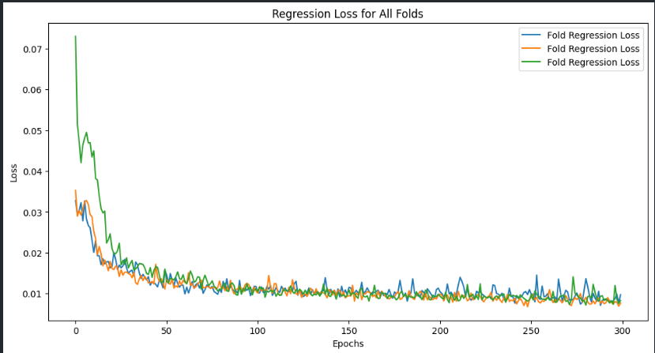

# Rapport Final : Projet Predictus Olympiae

## Table des Matières
1. [Introduction](#introduction)  
2. [Présentation du Projet](#présentation-du-projet)  
   2.1 [Contexte](#contexte)  
   2.2 [Problématique](#problématique)  
   2.3 [Objectifs](#objectifs)  
3. [Technologies et Données](#technologies-et-données)  
   3.1 [Technologies Utilisées](#technologies-utilisées)  
   3.2 [Sources de Données](#sources-de-données)  
4. [Méthodologie](#méthodologie)  
   4.1 [Planification et Organisation](#planification-et-organisation)  
   4.2 [Approches Supervisée et Non Supervisée](#approches-supervisée-et-non-supervisée)  
5. [Implémentation](#implémentation)  
   5.1 [Préparation des Données](#préparation-des-données)  
   5.2 [Modélisation Supervisée](#modélisation-supervisée)  
   5.3 [Clustering Non Supervisé](#clustering-non-supervisé)  
6. [Résultats et Analyse](#résultats-et-analyse)  
   6.1 [Performances des Modèles](#performances-des-modèles)  
   6.2 [Insights Clés](#insights-clés)  
7. [Plan d’Assurance Qualité](#plan-dassurance-qualité)  
   7.1 [Contrôle des Données](#contrôle-des-données)  
   7.2 [Validation et Revue de Code](#validation-et-revue-de-code)  
8. [Discussion et Limites](#discussion-et-limites)  
   8.1 [Forces et Faiblesses](#forces-et-faiblesses)  
   8.2 [Améliorations Futures](#améliorations-futures)  
9. [Conclusion](#conclusion)  
10. [Annexes](#annexes)  
    10.1 [Journal de Travail](#journal-de-travail)  
    10.2 [Code Source et Documentation](#code-source-et-documentation)  

---

## 1. Introduction
Les Jeux olympiques, véritable vitrine des performances sportives mondiales, représentent bien plus qu’un simple événement sportif. Ils incarnent l’excellence, le dépassement de soi, et sont souvent perçus comme un reflet des capacités économiques, culturelles et organisationnelles des nations participantes.  
Le projet **Predictus Olympiae** s’inscrit dans cette dynamique, visant à modéliser et prédire les performances olympiques des pays en fonction de multiples variables, telles que les données socio-économiques, démographiques et historiques. L’objectif ultime est de fournir un outil analytique robuste pour mieux comprendre les déterminants du succès sportif et éclairer les stratégies nationales.

---

## 2. Présentation du Projet

### 2.1 Contexte
Depuis leur résurrection moderne en 1896, les Jeux olympiques sont devenus un symbole global de l’unité et de la compétition entre nations. Chaque médaille remportée témoigne non seulement des efforts individuels, mais aussi du soutien institutionnel et des investissements nationaux dans le sport.  
Dans ce contexte, le projet **Predictus Olympiae** ambitionne d’identifier les facteurs clés permettant de prédire les performances olympiques. En s’appuyant sur des données variées, il explore les liens entre des variables telles que le PIB, la population, les dépenses en infrastructures sportives, et les résultats sportifs passés.

### 2.2 Problématique
La prédiction des performances olympiques constitue un défi complexe pour plusieurs raisons :  
- **Hétérogénéité des données** : Les variables influençant les performances sportives proviennent de domaines variés (économie, politique, climat).  
- **Complexité des interactions** : Les relations entre ces variables sont rarement linéaires et peuvent inclure des effets multiplicateurs ou contextuels.  
- **Données historiques incomplètes** : Certaines variables, telles que le financement sportif ou les données démographiques spécifiques, ne sont pas toujours disponibles ou homogènes.  
Le projet doit donc relever ces défis pour construire des modèles fiables et interprétables.

### 2.3 Objectifs
Le projet s’articule autour des objectifs suivants :  
- **Must Have** :  
  - Développer un modèle prédictif performant basé sur l’apprentissage supervisé pour estimer les performances des pays aux Jeux olympiques.  
  - Fournir des prédictions exploitables pour un large éventail de disciplines sportives.  
- **Nice to Have** :  
  - Produire une analyse détaillée par discipline sportive afin d’identifier les forces et faiblesses des pays.  
  - Explorer des techniques avancées d’optimisation des modèles, telles que le fine-tuning des hyperparamètres ou l’intégration d’approches de deep learning.  
  

---

## 3. Technologies et Données

## 3. Technologies et Données

### 3.1 Sources de Données
Le projet **Predictus Olympiae** repose sur une collecte et une exploitation rigoureuse de données provenant de diverses sources fiables. Les principales catégories de données utilisées incluent :  
- **Données historiques des médailles olympiques** : Informations sur les performances des nations aux Jeux olympiques passés, via Kaggle. Nous avons transformé les données brutes en un format tel que le nombre d'athlètes présent dans les 10 premier pour chaque nation dans chque discipline.

- **Données socio-économiques et démographiques** : Issues notamment des ensembles de données de Gapminder, ces données couvrent des indicateurs tels que :  
  - **Mortalité infantile** : Mesure du taux de mortalité des enfants de moins de cinq ans, reflétant les conditions de santé et de développement d’une nation.  
  - **Fertilité** : Nombre moyen d’enfants par femme, indicateur clé des dynamiques démographiques.  
  - **PIB par habitant (GDP_capita)** : Représentant la richesse économique d’un pays, il est essentiel pour comprendre les ressources disponibles pour le développement sportif.  
  - **Espérance de vie** : Indicateur de la qualité de vie globale et des infrastructures de santé.  
  - **Population totale** : Facteur influençant la taille du vivier de talents sportifs disponibles dans chaque pays.  

Ces données ont été extraites, nettoyées et combinées pour former une base solide permettant l’entraînement et la validation des modèles prédictifs développés dans ce projet. La richesse et la variété de ces sources offrent une vue d’ensemble des déterminants possibles des performances olympiques, tout en fournissant une granularité suffisante pour des analyses approfondies.  

Nous avons choisi de travailler sur les disciplines suivantes :
```python
sports_summer_before_1988 = [
    'Shooting', 'Diving', 'Canoe Sprint', 'Cycling Road', 'Football', 'Boxing', 'Basketball',
    'Cycling Track', 'Fencing', 'Water Polo', 'Wrestling', 'Artistic Gymnastics', 'Weightlifting',
    'Modern Pentathlon', 'Hockey', 'Athletics', 'Swimming', 'Sailing', 'Rowing'
]
sports_summer_after_1988 = [
    'Shooting', 'Diving', 'Canoe Sprint', 'Cycling Road', 'Football', 'Boxing', 'Basketball',
    'Cycling Track', 'Fencing', 'Table Tennis', 'Badminton', 'Water Polo', 'Wrestling',
    'Artistic Gymnastics', 'Canoe Slalom', 'Rhythmic Gymnastics', 'Weightlifting', 'Modern Pentathlon',
    'Hockey', 'Volleyball', 'Artistic Swimming', 'Athletics', 'Swimming', 'Sailing', 'Rowing',
    'Tennis', 'Equestrian', 'Archery', 'Handball', 'Judo'
]
```
En effet, pour les disciplines restantes nous n'avons pas jugé que l'historiques des performance était suffisant.

## 4. Méthodologie
### 4.1 Planification et Organisation
distribution des tâches, répartition des rôles, gestion des délais, communication interne, etc.

### 4.2 Approches Supervisée et Non Supervisée


---
## 5. Implémentation
### 5.1 Préparation des Données
La préparation des données a constitué une étape cruciale du projet, notamment en raison des divergences observées dans les noms des pays selon les différentes sources utilisées. Ces conflits provenaient des différences linguistiques (anglais, français), des variations dans la nomenclature des pays (utilisation de noms officiels ou abrégés), et des évolutions géopolitiques au fil du temps (changements de noms de pays, disparition ou création de nouvelles entités étatiques).  

Les données issues de **Gapminder** et de **Kaggle** ont nécessité une harmonisation manuelle, ce qui a représenté un effort conséquent. Par exemple :  
- Certains pays étaient désignés par des noms différents dans les deux bases, tels que "Côte d'Ivoire" (français) et "Ivory Coast" (anglais).  
- D'autres pays étaient répertoriés sous des appellations historiques ou obsolètes, comme "URSS" pour des données antérieures à sa dissolution, tandis que les données récentes utilisaient les noms des pays indépendants issus de son éclatement.  
- Dans certains cas, des entités telles que "République tchèque" et "Tchécoslovaquie" coexistaient dans les jeux de données, nécessitant un regroupement ou une distinction en fonction de la période.  

Cette étape a nécessité plusieurs jours de travail pour ajuster manuellement la liste des pays, garantir leur uniformité, et aligner les données sur une nomenclature commune. Une attention particulière a été portée aux subtilités historiques et linguistiques afin de minimiser les erreurs d'interprétation et d'assurer la fiabilité des analyses.  

### 5.2 Modélisation Supervisée
#### 5.2.1 Itération 1 : Modèle de Régression Linéaire baseline
Le premier modèle développé dans le cadre du projet était une régression linéaire simple appliquée sur le dataset de 1992, visant à établir une relation linéaire entre les variables socio-économiques et les performances olympiques. Les métriques de performance utilisées étaient le RMSE (Root Mean Squared Error) et l'optimiseur adam ainsi que le r^2 de Pearson pour l'évaluation.


Notre premier modèle sert de baseline pour la suite de notre projet. Il nous permet de voir les améliorations que nous pouvons apporter. Un R^2 de 0.58 est relativement médiocre en revanche nous pouvons voir que le mlp est capable d'apprendre des caractéristiques d'après la courbe d'apprentissage.

#### 5.2.2 Itération 2 : Modèle de Régression Linéaire avec dataset complet
Dans cette deuxième itération, nous avons décidé d'ajouter des variables explicatives supplémentaires pour améliorer la performance de notre modèle. Les métriques de performance utilisées étaient le RMSE et le R^2 de Pearson pour l'évaluation.


Nous constatons qu'en ajoutant plus de variables explicatives, notre modèle a une meilleure performance. En effet, le R^2 de Pearson passe de 0.58 à 0.87. Cela signifie que 87% de la variance de notre variable cible est expliquée par nos variables explicatives. Cependant nous pouvons voir que dans le coin gauche du bas nous avons un grand nombre de pays qui ne sont pas forcément bien traité par notre modèle.


### 5.2.3 Itération 3 : Modèle de Régression Linéaire avec deux branches

Dans cette itération nous avons décidé de construire un modèle de prédiction plus complexe. Une branche pour effectuer une classification selon la performance du pays et une autre qui se chargera de la régression. Les métriques restent les mêmes que pour les itérations précédentes. Nous attendons un granularité plus fine de ce modèle.

Nous commencerons par traiter 2 classes pour la branche concernée.


Nous pouvons voir en premier lieu que notre modèle est capable de classifier les pays en 2 classes selon la performance du pays nous avons fixé le seuil à 0.3. Après normalisation des valeurs des performance des délégations si le pays à une performance < 0.3 alors il est marqué comme un pays de classe 0 sinon 1. A noter que les données des performances correspondent aux nombres d'athlètes faisant partie du top 10 pour les disciplines retenues pour chaque éditions. 

Nous pouvons en premier lieu de constater que le modèle est capable de classifier les pays selon les classes qui leur ont été assignées. En effet, l'accuracy semble bien augmenter au fil de l'entrainement. Nous obtenons un score f1 de 0.9085 et une accuracy de 0.93. La matrice de confusion nous permet de confirmer ces résultats relativement bons.

Concernant la régression nous ne pouvons pas en dire autant. Il semble que le réseau est capable de diminuer son loss selon l'entrainement mais la MSE ne semble pas diminuer. Nous observons plutot une courbe erratique. 
A noter que nous avons du considérablement augmenter le nombre de neurones pour la branche de la régression. Dans le cas contraire le modèle semblait être perturbé par la backpropagation de la classification.

### 5.2.4 itération 4 : Modèle de Régression Linéaire avec deux branches et 3 classes
Dans cette itération nous proposons de passer à 3 classes pour la classification. Nous avons décidé de classer les pays en 3 classes selon leur performance. Les métriques restent les mêmes que pour les itérations précédentes. Nous attendons un granularité plus fine de ce modèle. Les seuils sont fixés à 0.2 et 0.8 pour la définition des classes de pays.





Nous observons un loss, autant sur la sortie de la régression que sur la classification qui démontre une bonne stabilité semblant capturer correctement des caractéristiques. La MSE de la régression cette fois est stable pour tous les folds et semble démonter un apprentissage également. Concernant l'accuracy nous obtenons une courbe plus cohérente dans le sens que les oscillations restent stables et semblent converger vers une meilleur résultat ~0.87. Nous obtenons un F1 de 0.90 pour la classification en 3 classes.

L'analyse du R^2 est plutôt satisfaisant nous arrivons avec un coefficient de Pearson de 0.77 alors que le modèle en 2 classes était négatif. Nous n'atteignons pas le 0.87 du modèle de l'itération 2 mais nous sommes capable de classifier les pays avec le modèle actuel. La classification influence certainement la performance de la régression c'est probablement pourquoi nous ne sommes pas aussi bon que le modèle de l'itération 2. 

A noter qu'en comparaison avec l'itération précédente, nous avons environ 4000 paramètres avec le modèle actuel. Le modèle précédent demandait l'ajout de multiples couches pour la régression ce qui nous conduisait à avoir environ 68300 paramètres. La passage avec un nombre de classes plus granuleux permet certainement au modèle de mieux comprendre le comportement des performance et d'adapter son échelle de prédiction.


### 5.3 Clustering Non Supervisé

### 5.3.1 Itération 5 : SOM

Pour cette itération nous avons décidé d'utiliser un réseau de neurones SOM pour effectuer un clustering des pays. Nous avons décidé de fixer le nombre de clusters à 5. Les données d'entrée sont le dataset avec les 3 classes selon les seuils précédents.  


```python
Cluster to Country and Class Mapping:
Cluster (0, 0): 11 countries -> ['Great Britain', 'Luxembourg', 'Belgium', 'USA', 'Slovenia', 'Spain', 'Japan', 'Italy', 'Denmark', 'Netherlands', 'Ireland']
Class distribution in Cluster (0, 0): {0: 1, 1: 1, 2: 1}
Cluster (0, 1): 16 countries -> ['Ukraine', 'Hungary', 'Slovakia', 'Armenia', 'Romania', 'South Korea', 'Latvia', 'Estonia', 'Belarus', 'Turkey', 'Russia', 'Georgia', 'Peru', 'Poland', 'Czech Republic', 'Lithuania']
Class distribution in Cluster (0, 1): {0: 1, 1: 1}
Cluster (0, 2): 10 countries -> ['Hong Kong China', 'Austria', 'Iceland', 'Sweden', 'Switzerland', 'Canada', 'Norway', 'New Zealand', 'Finland', 'Germany']
Class distribution in Cluster (0, 2): {0: 1, 1: 1, 2: 1}
Cluster (0, 3): 6 countries -> ['Chile', 'Iran', 'Kazakhstan', 'Israel', 'Argentina', 'Uzbekistan']
Class distribution in Cluster (0, 3): {0: 1}
Cluster (0, 4): 5 countries -> ['Oman', 'Saudi Arabia', 'UAE', 'Kuwait', 'Qatar']
Class distribution in Cluster (0, 4): {0: 1}
Cluster (1, 0): 5 countries -> ['France', 'Cyprus', 'Australia', 'Croatia', 'Portugal']
Class distribution in Cluster (1, 0): {0: 1, 1: 1}
Cluster (1, 1): 10 countries -> ['Serbia', 'Lebanon', 'Mexico', 'Greece', 'Moldova', 'Albania', 'Bulgaria', 'Montenegro', 'Bosnia and Herzegovina', 'Uruguay']
Class distribution in Cluster (1, 1): {0: 1}
Cluster (1, 2): 2 countries -> ['India', 'China']
Class distribution in Cluster (1, 2): {0: 1, 1: 1}
Cluster (1, 3): 4 countries -> ['Kyrgyzstan', 'Mongolia', 'North Korea', 'Tajikistan']
Class distribution in Cluster (1, 3): {0: 1}
Cluster (1, 4): 10 countries -> ['Jordan', 'Namibia', 'Morocco', 'Djibouti', 'Turkmenistan', 'Egypt', 'Algeria', 'Botswana', 'Syria', 'Tunisia']
Class distribution in Cluster (1, 4): {0: 1}
Cluster (2, 0): 4 countries -> ['Costa Rica', 'Trinidad and Tobago', 'Thailand', 'Cuba']
Class distribution in Cluster (2, 0): {0: 1, 1: 1}
Cluster (2, 1): 6 countries -> ['Paraguay', 'Venezuela', 'Bahamas', 'Brazil', 'Colombia', 'El Salvador']
Class distribution in Cluster (2, 1): {0: 1}
Cluster (2, 2): 4 countries -> ['Myanmar', 'Eswatini', 'Azerbaijan', 'South Africa']
Class distribution in Cluster (2, 2): {0: 1}
Cluster (2, 3): 2 countries -> ['Pakistan', 'Zimbabwe']
Class distribution in Cluster (2, 3): {0: 1}
Cluster (2, 4): 3 countries -> ['Iraq', 'Eritrea', 'Sudan']
Class distribution in Cluster (2, 4): {0: 1}
Cluster (3, 0): 5 countries -> ['Dominican Republic', 'Indonesia', 'Guatemala', 'Honduras', 'Vietnam']
Class distribution in Cluster (3, 0): {0: 1}
Cluster (3, 1): 3 countries -> ['Ecuador', 'Bangladesh', 'Philippines']
Class distribution in Cluster (3, 1): {0: 1}
Cluster (3, 2): 3 countries -> ['Kenya', 'Ghana', 'Madagascar']
Class distribution in Cluster (3, 2): {0: 1}
Cluster (3, 3): 6 countries -> ['Zambia', 'Senegal', 'Ethiopia', 'Mozambique', 'Rwanda', 'Burundi']
Class distribution in Cluster (3, 3): {0: 1}
Cluster (3, 4): 4 countries -> ['Mali', 'Angola', 'Somalia', 'Burkina Faso']
Class distribution in Cluster (3, 4): {0: 1}
Cluster (4, 0): 8 countries -> ['Panama', 'Sri Lanka', 'Fiji', 'Malaysia', 'Guyana', 'Suriname', 'Jamaica', 'Solomon Islands']
Class distribution in Cluster (4, 0): {0: 1}
Cluster (4, 1): 4 countries -> ['Nicaragua', 'Gabon', 'Papua New Guinea', 'Haiti']
Class distribution in Cluster (4, 1): {0: 1}
Cluster (4, 2): 5 countries -> ['Sierra Leone', 'Congo Dem. Rep.', 'Guinea-Bissau', 'Ivory Coast', 'Liberia']
Class distribution in Cluster (4, 2): {0: 1}
Cluster (4, 3): 5 countries -> ['Uganda', 'Togo', 'Central African Republic', 'Tanzania', 'Cameroon']
Class distribution in Cluster (4, 3): {0: 1}
Cluster (4, 4): 2 countries -> ['Nigeria', 'Benin']
Class distribution in Cluster (4, 4): {0: 1}
```

Après plusieurs essais nous avons pu obtenir une carte de 5x5 clusters avec un entrainement de 1000 itérations. Le clustering nous parait pas parfait néanmoins nous pouvons remarquer que la plupart des pays de classe 0 se retrouvent bien ensemble ainsi que les pays de classe 1. En ce qui concerne les pays de classe 2 ceux-ci sont dans le neurone de sortie # (0,0) et (0,2). Ceci est pertinent car ces pays sont ceux qui ont les meilleures performances. Ils bien séparés des autres pays. Nous remarquons également que nous trouvons des pays de memes régions géographique souvent dans le même cluster.

---
## 6. Résultats et Analyse
### 6.1 Performances des Modèles
- Présentation des métriques comme F1-score, précision, et RMSE.
- Comparaison des performances entre approches supervisées et non supervisées.

### 6.2 Insights Clés
- Identification des facteurs clés influençant les performances olympiques.
- Analyse des clusters régionaux et des tendances générales.


## 8. Discussion et améliorations
### 8.1 Forces et Faiblesses
- Points forts du projet 
- Limites rencontrées

### 8.2 Améliorations
- Intégration de nouvelles variables.
- Exploration d’approches de modélisation plus avancées.


## 9. Conclusion

## 10. Annexes
### 10.1 Journal de Travail

